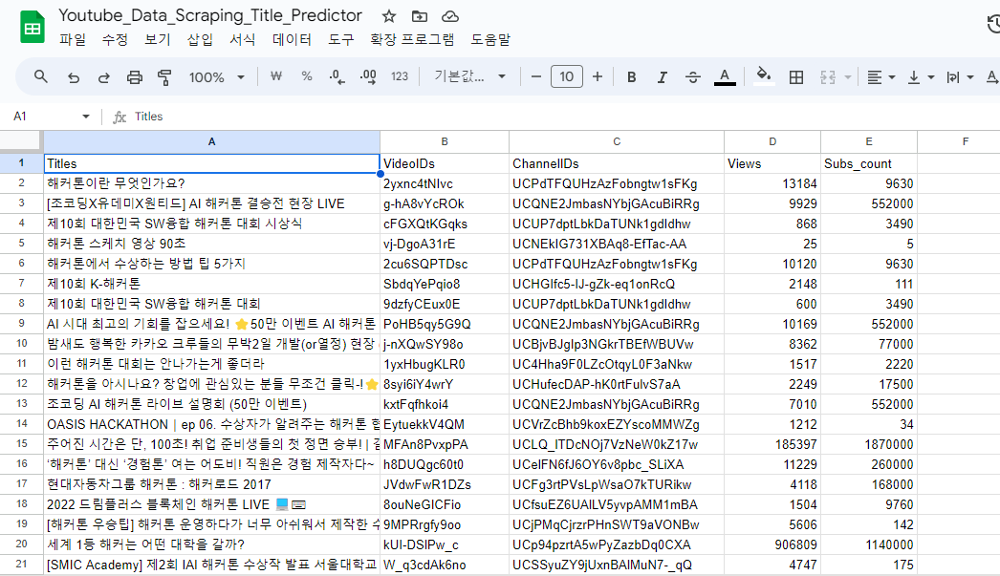

# 유튜브 AI

> 사용 기술 목록  
>           

### 구현 화면


### 구현 방법

우선 데이터를 만들어서 데이터를 전처리하는 과정부터 수행했습니다. 스프레드 시트의 확장 기능 **App scripts**를 활용하여 유튜브 데이터를 끌고 왔습니다.

```js
// 스크랩을 위한 유튜브 API 크롤링 코드
const keywords = [
  '해커톤',
  '개발',
  '프로그래밍',
  '웹',
  '코딩',
  '자바스크립트',
  'JS',
  '인공지능',
  '머신러닝',
  '딥러닝',
  '신입 개발자',
  '대학생 개발',
  '대학생 코딩',
  '대학생 프로그래밍',
  '경북대',
  '프론트엔드',
  '백엔드',
]

let spreadSheet = SpreadsheetApp.getActiveSpreadsheet()
let activeSheet = spreadSheet.getActiveSheet()

let data_scraped = dataScraper(keywords)
Logger.log(data_scraped)

activeSheet
  .getRange(1, 1, 1, 5)
  .setValues([['Titles', 'VideoIDs', 'ChannelIDs', 'Views', 'Subs_count']])
activeSheet
  .getRange(2, 1, data_scraped.title.length, 1)
  .setValues(data_scraped.title)
activeSheet
  .getRange(2, 2, data_scraped.videoIDs.length, 1)
  .setValues(data_scraped.videoIDs)
activeSheet
  .getRange(2, 3, data_scraped.channelIDs.length, 1)
  .setValues(data_scraped.channelIDs)
activeSheet
  .getRange(2, 4, data_scraped.views.length, 1)
  .setValues(data_scraped.views)
activeSheet
  .getRange(2, 5, data_scraped.subs_count.length, 1)
  .setValues(data_scraped.subs_count)

function dataScraper(keywords) {
  let title = []
  let videoIDs = []
  let channelIDs = []
  let views = []
  let subs_count = []

  keywords.forEach((keyword) => {
    console.log(keyword)
    let keyword_search = searchByKeyword(keyword)
    title.push(keyword_search.title)
    videoIDs.push(keyword_search.videoIDs)
    channelIDs.push(keyword_search.channelIDs)

    let view_results = searchByVideoID(keyword_search.videoIDs)
    views.push(view_results)

    let sub_results = searchByChannelID(keyword_search.channelIDs)
    subs_count.push(sub_results)
  })

  title = title.flat().map((x) => [x])
  videoIDs = videoIDs.flat().map((x) => [x])
  channelIDs = channelIDs.flat().map((x) => [x])
  views = views.flat().map((x) => [x])
  subs_count = subs_count.flat().map((x) => [x])

  results = {
    title: title,
    videoIDs: videoIDs,
    channelIDs: channelIDs,
    views: views,
    subs_count: subs_count,
  }
  return results
}

function searchByKeyword(keyword) {
  const results = YouTube.Search.list('id, snippet', {
    q: keyword,
    maxResults: 50,
  })
  let videoIDs = results.items.map((video_info) => {
    if (video_info.id.videoId) {
      return video_info.id.videoId
    }
    return '0qfXPIBFyHA'
  })
  let channelIDs = results.items.map(
    (video_info) => video_info.snippet.channelId,
  )
  let title = results.items.map((video_info) => video_info.snippet.title)
  let keyword_search = {
    videoIDs: videoIDs,
    channelIDs: channelIDs,
    title: title,
  }
  return keyword_search
}

function searchByVideoID(videoIDs) {
  const results = YouTube.Videos.list('statistics', {
    id: videoIDs,
  })
  let views = results.items.map((item) => item.statistics.viewCount)
  return views
}

function searchByChannelID(channelIDs) {
  const results = channelIDs.map((channelID) =>
    YouTube.Channels.list('statistics', {
      id: channelID,
    }),
  )
  let subs_count = results.map(
    (item) => item.items[0].statistics.subscriberCount,
  )
  return subs_count
}
```

결과 아래와 같이 데이터를 크롤링 할 수 있었습니다.  


### 러닝을 돌리기 위한 전처리

현재 데이터는 필요없는 feature나 제목에 특수 문자 등 사전 작업할 데이터가 많기 때문에 이것을 없애는 과정을 선 수행합니다.

조회수 / 구독자 수를 구한 후 구독자 비례 조회수가 상위 50프로를 넘으면 타겟으로 1 아니면 0으로 지정 해준 후 특수 문자를 제외한 제목을 transformer 모델로 학습시켜줍니다. 자세한 코드는 아래 링크에서 확인 가능합니다.

[데이터 전처리 링크](https://github.com/Suhwan0818/Youtube-AI-web/blob/master/YouTube_Data_Cleaning_Preprocessing.ipynb)  
[처리한 데이터 파인 튜닝 링크](https://github.com/Suhwan0818/Youtube-AI-web/blob/master/YouTube_Title_Predictor_Fine_Tuning.ipynb)

transformer로써 **BertTokenizer**를 사용한 가장 큰 이유는 사전 학습이 완료되었다는 장점 때문입니다. 파인 튜닝을 해줘야한다는 번거러움이 있지만 이미 전처리과정으로 거의 다 수행했기에 알맞은 사용이라 생각했습니다.

> **BertTokenizer 입출력 예시**
>
> **✔ input**
>
> : 텍스트 (List[str])
>
> (예시) sequence= ["apple people water", "people apple water", "water apple people"]
>
> **✔ output**
>
> : 토큰화 결과 (Dict)
>
> (예시) {'input_ids': tensor([[ 101, 6207, 2111, 2300, 102], [ 101, 2111, 6207, 2300, 102], [ 101, 2300, 6207, 2111, 102]]), 'token_type_ids': tensor([[0, 0, 0, 0, 0], [0, 0, 0, 0, 0], [0, 0, 0, 0, 0]]),
>
> 'attention_mask': tensor([[1, 1, 1, 1, 1], [1, 1, 1, 1, 1], [1, 1, 1, 1, 1]]) }

### flask 연결

학습된 데이터를 web으로 쏴줘야 함으로 API형태를 만들어줄 필요가 있습니다. flask를 사용해서 restful하게 만들어 줬습니다.

```python
import tensorflow as tf
import transformers
import numpy as np
import re
from transformers import BertTokenizer

tokenizer = BertTokenizer.from_pretrained('bert-base-multilingual-cased', do_lower_case = False)

from flask import Flask
from flask import jsonify, request
from flask_cors import CORS, cross_origin

def bert_encode(data, maximum_length):
    input_ids = []
    attention_masks = []

    for i in data:
        text = re.compile('[ㄱ-ㅎ가-힣a-zA-Z0-9]+').findall(i)
        text = " ".join(text)
        encoded = tokenizer.encode_plus(text,
                                        add_special_tokens = True,
                                        max_length = maximum_length,
                                        pad_to_max_length = True,
                                        truncation = True)
        input_ids.append(encoded['input_ids'])
        attention_masks.append(encoded['attention_mask'])
    return np.array(input_ids), np.array(attention_masks)

loaded_model = tf.keras.models.load_model('bert_model_v1.h5', custom_objects ={"TFBertModel" : transformers.TFBertModel})

# flask로 만들기
app = Flask(__name__)
cors = CORS(app)
app.config['CORS-HEADERS'] = 'Content-Type'
@app.route('/')
def index():
    return 'youtube title recommend AI'

@app.route('/predict', methods = ['GET', 'POST'])
def predict():
    data = {'requested' : 'request'}

    params = request.json
    title = params['input']
    input_id, attention_mask = bert_encode([title], 30)
    predict_sample = loaded_model.predict([input_id, attention_mask])
    score = str(int(predict_sample[0][0] * 100))

    data['score'] = score
    return jsonify(data)

if __name__ == '__main__':
    app.run()
```
